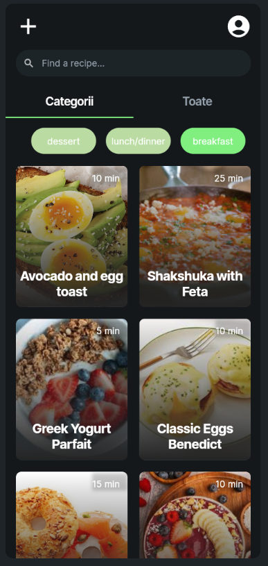
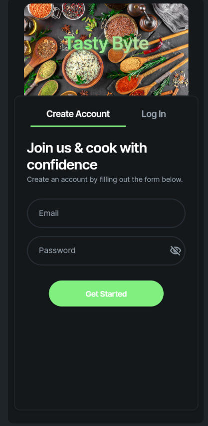
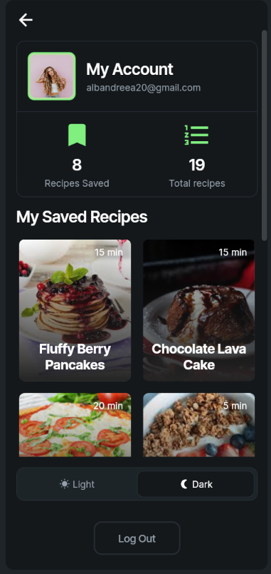
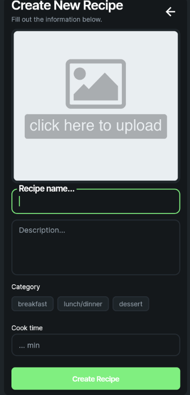
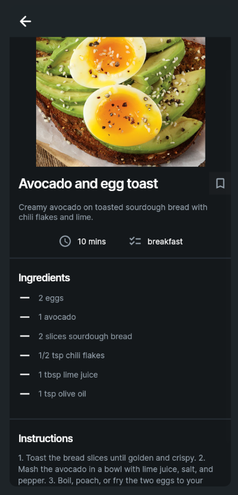

# Tasty-Bite-Recipe-App
FlutterFlow mobile app featuring recipe search, saved favorites, and dynamic UI layouts.

## 🚀 Features
* **Recipe Search:** Fast search implementation to find meals instantly.
* **Saved Recipes:** State management implementation to allow users to bookmark their favorite recipes.
* **Recipe Details:** Clean UI layout showcasing ingredients and cooking steps.

## 🛠️ Tech Stack
* **Frontend/UI:** FlutterFlow (Flutter framework)
* **State Management:** FlutterFlow App/Page State

## 📸 Preview

---
*Note: This project was built using a FlutterFlow Pay-As-You-Go plan. The repository serves as a portfolio showcase of the UI/UX design, application logic, and feature implementation.*
